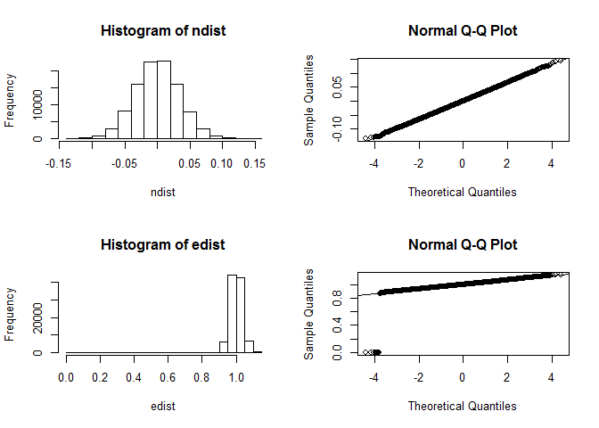

# Bootstrap_CLT
Harry Bhasin  
June 8, 2016  
# Introduction
The purpose of this module is to illustrate the Central Limit Theorem using the bootstrap code in R.

# Specifications
The overall design approach is to use R and the built-in functions to take normal random and exponention distributions. These distributions are taken over and over as per the bootstrap algorithm. These distributions are applied to Central Limit Theorem to prove that as the distribution sample size increases so does the Standard Diviation of the Mean of the distribution.

```r
# Global variables for the number of samples and the normal and the exponention distribution
iterations = 99999
ndist <- numeric(iterations)
edist <- numeric(iterations)
```
# Function
  * Centeral Limit Theorem function
  * Arguments:
  *  iterations: number of samples
  * Output:
  *  console output with standard deviation of both Noraml and Exponential
  * Return:
  *  In return this fucntion sets up the both normal and exponential lists
#

```r
clt <- function (iterations) {
  for (i in 9:iterations) {
    rn <- sample(rnorm(999, mean=0, sd=1), 9999, replace=TRUE)
    ndist[i] <- mean(rn)
    re <- sample(rexp(999, rate=1), 9999, replace=TRUE)
    edist[i] <- mean(re)
    if (i == 99 | i == 999 | i == 9999 | i == 99999) {
        sdrn <- sd(ndist)
        sdre <- sd(edist)
        cat("Output: Iter = ", i, "normalclt = ", sdrn, "expclt = ", sdre, "\n")
    }
  }
  result <- list(ndist=ndist, edist=edist)
  return(result)
}
```
# Function
  * Centeral Limit Theorem plot function
  *   cltplot(ndist, edist)
  *   Arguments:
  *     Normal and Exponential lists
  *   Output:
  *     Plots for histogram and normal QQ for both noraml and exponential lists
  *   Return:
  *     None.

```r
cltplot <- function(ndist, edist) {
    par(mfrow = c(2, 2))
    hist(ndist)
    qqnorm(ndist)
    qqline(ndist)
    hist(edist)
    qqnorm(edist)
    qqline(edist)
}
```

```r
# Call the Central Limit Theorem implementation
bootstrapclt <- clt(iterations)
```

```
## Output: Iter =  99 normalclt =  0.001177966 expclt =  0.03035115 
## Output: Iter =  999 normalclt =  0.003323805 expclt =  0.09918612 
## Output: Iter =  9999 normalclt =  0.01048964 expclt =  0.299975 
## Output: Iter =  99999 normalclt =  0.03326495 expclt =  0.03423729
```

```r
# Call the plot funtion to represent the data
cltplot(bootstrapclt$ndist, bootstrapclt$edist)
```

<!-- -->
